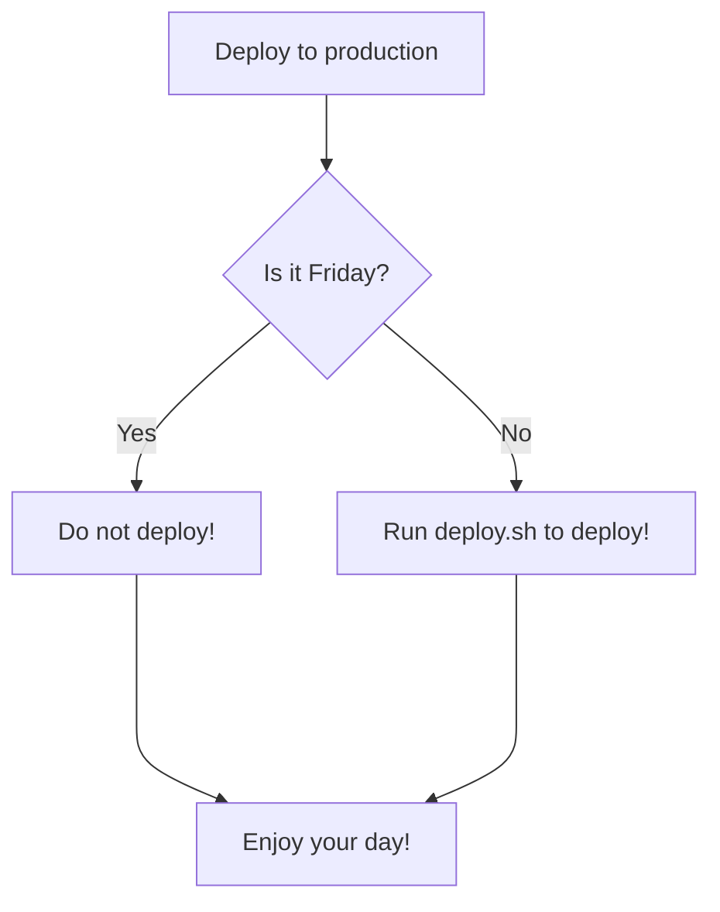
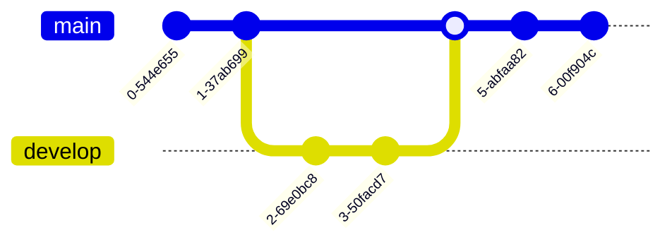

### How do deploy

Here is a simple flow chart:

```mermaid
graph TD;
    A-->B;
    A-->C;
    B-->D;
    C-->D;
```

```mermaid
graph TD;
A[Deploy to production] --> B{Is it Friday?};
    B -- Yes --> C[Do not deploy!];
    B -- No --> D[Run deploy.sh to deploy!];
    C ----> E[Enjoy your day!];
    D ----> E[Enjoy your day!];
```

```mermaid
graph TD;
    A-->B;
    A-->C;
    B-->D;
    C-->D;
```

```mermaid
gitGraph
   commit
   commit
   branch develop
   checkout develop
   commit
   commit
   checkout main
   merge develop
   commit
   commit
```
